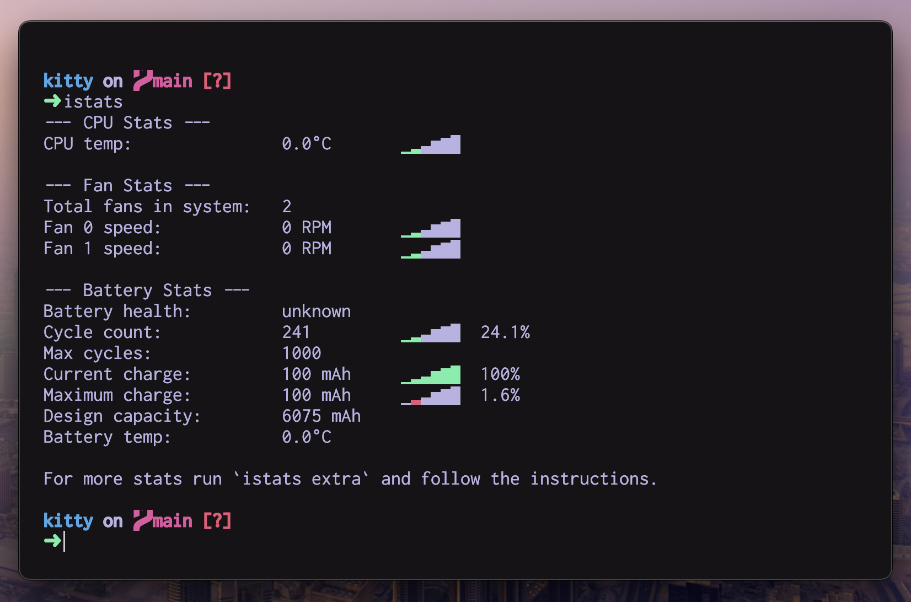

# My Kitty Config

[Kitty, by Kovid Goyal](https://sw.kovidgoyal.net/kitty/), is a GPU accelerated terminal emulator that can be very heavily customized. This repository exists for me to keep track of my customizations, as well as make these customizations available for anyone else interested in them.

## Getting Started

Clone or fork this repository to `~/.config/kitty`.

## Icon

I personally am not a fan of the stock icon. Thankfully, Rune Warhuus (DinkDonk) has created [a beautiful modern looking icon which we can use as a replacement.](https://github.com/DinkDonk/kitty-icon) I’ve provided a copy in this repository. If you cloned or forked the repository to `~/.config/kitty`, you should be able to install the custom icon with the terminal command below.

```sh
kitty +runpy 'from kitty.fast_data_types import cocoa_set_app_icon; import sys; cocoa_set_app_icon(*sys.argv[1:]); print("OK")' ~/.config/kitty/icons/kitty-dark.icns
```

## Configuration

If you cloned or forked the repository to `~/.config/kitty`, then the configuration is already installed and ready to go! Your local copy of Kitty should look like the image below.


